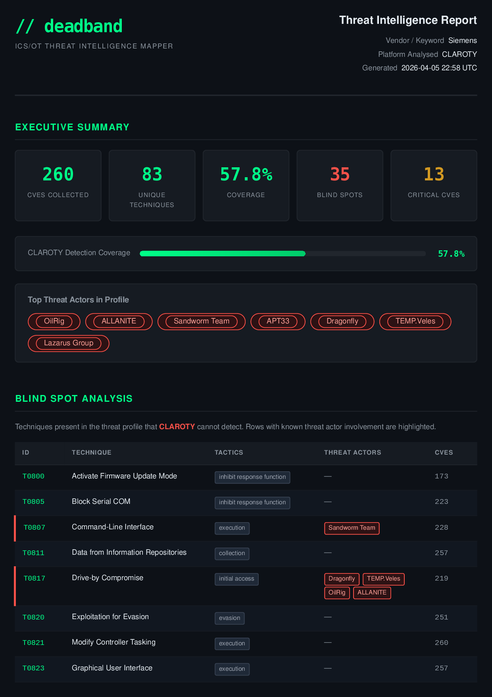

# // deadband
### ICS/OT Adversary Mapping Tool

Deadband takes a vendor or protocol name, pulls every relevant CVE from NVD and CISA, maps them to [MITRE ATT&CK for ICS](https://attack.mitre.org/matrices/ics/) techniques, figures out which threat actors use those techniques, and then tells you exactly which ones your security platform can't detect — all in one command, all in a PDF you can actually hand to someone.



---

## What it does

```
CVEs (NVD + CISA) → ATT&CK for ICS techniques → Threat group attribution → Detection gap analysis → PDF report
```

One command in, one report out. Or spin up the web UI and do it from a browser.

---

## Web UI

Deadband has a Flask-based web UI with live pipeline streaming — you can watch the analysis run in real time and download the PDF report directly from the browser.

```bash
python app.py
```

Then open `http://127.0.0.1:5000`.

Features:
- Platform dropdown populated from `detection_coverage.json`
- Live log output streamed via Server-Sent Events as the pipeline runs
- Result summary cards — CVEs collected, techniques found, coverage %, blind spots
- Coverage bar and top blind spot list with threat actor attribution
- One-click PDF download

---

## Supported platforms

| Category | Platforms |
|----------|-----------|
| OT/ICS | Claroty, Dragos, Nozomi |
| SIEM | Splunk, QRadar, Microsoft Sentinel |
| EDR | CrowdStrike Falcon, Microsoft Defender |
| Open Source | Zeek, Snort |

Detection coverage is defined in `data/detection_coverage.json` — adding a new platform is just a JSON edit.

---

## Installation

```bash
git clone https://github.com/DaSa7/deadband.git
cd deadband

python3 -m venv venv
source venv/bin/activate

pip install -r requirements.txt
```

You'll need a free NVD API key — grab one at [nvd.nist.gov/developers/request-an-api-key](https://nvd.nist.gov/developers/request-an-api-key). Takes about 2 minutes.

Create a `.env` file in the project root:

```
NVD_API_KEY=your-key-here
```

WeasyPrint needs a couple of system dependencies on Debian/Kali:

```bash
sudo apt install libpango-1.0-0 libpangoft2-1.0-0 libpangocairo-1.0-0 -y
```

---

## Usage

### CLI

```bash
# Generate a threat intelligence report
python main.py --vendor "Siemens" --platform claroty

# Try a different vendor and platform
python main.py --vendor "Schneider" --platform dragos
python main.py --vendor "Modbus" --platform splunk

# Custom output path
python main.py --vendor "Rockwell" --platform sentinel --output reports/rockwell_sentinel.pdf

# See all available platforms
python main.py --list-platforms
```

Reports are saved to `reports/` by default, named `deadband_{vendor}_{platform}.pdf`.

### Web UI

```bash
python app.py
# → http://127.0.0.1:5000
```

---

## Example output

Running against Siemens + Claroty:

```
// deadband — ICS/OT Threat Intelligence Mapper
   Vendor   : Siemens
   Platform : claroty
   Output   : reports/deadband_siemens_claroty.pdf

=== Deadband Collector: 'Siemens' ===
[NVD] Total results reported by API: 259
[NVD] Done. 259 CVEs collected.
[CISA] Found 1 entries matching 'Siemens'.

[Mapper] Indexed 83 techniques, 14 groups.
[Mapper] Done. 260/260 CVEs matched at least one technique.

[GapAnalyzer] Threat profile contains 83 unique techniques.
[GapAnalyzer] Done. 48/83 techniques covered (57.8%). 35 blind spot(s) identified.

✓ Report ready: reports/deadband_siemens_claroty.pdf
  83 techniques | 48 covered | 35 blind spots | 57.8% coverage
```

The PDF report includes:
- Executive summary with coverage stats and top threat actors
- Blind spot table — techniques your platform can't detect, flagged by actor involvement
- Top CVEs by CVSS score
- Full covered technique list

---

## Project structure

```
deadband/
├── data/
│   ├── attack_ics.json          # ATT&CK for ICS bundle (auto-downloaded)
│   └── detection_coverage.json  # Platform detection coverage config
├── src/
│   ├── collector.py             # NVD + CISA data ingestion
│   ├── mapper.py                # CVE → ATT&CK ICS technique + group mapping
│   ├── gap_analyzer.py          # Detection gap analysis
│   └── reporter.py              # HTML + PDF report generation
├── templates/
│   └── index.html               # Web UI
├── reports/                     # Generated reports go here
├── assets/                      # Screenshots and static files
├── app.py                       # Flask web UI entry point
├── main.py                      # CLI entry point
└── requirements.txt
```

---

## How the mapping works

Technique matching is keyword-based — keywords extracted from CVE descriptions are checked against ATT&CK for ICS technique names and descriptions. Each match gets a score based on keyword overlap, and techniques are ranked by score. It's not perfect (broad keywords inflate match rates) but it gets you a solid working threat profile that you'd then refine manually.

Threat group attribution comes directly from the ATT&CK for ICS STIX bundle — the same relationships MITRE publishes. So when Deadband says Sandworm uses T0807, that's from MITRE's data, not a guess.

Detection coverage is seeded from public vendor documentation, ATT&CK evaluations, and capability disclosures. It lives in a JSON file you can edit to reflect your actual deployed stack.

---

## Data sources

| Source | What it provides |
|--------|-----------------|
| [NVD API 2.0](https://nvd.nist.gov/developers/vulnerabilities) | CVE details, CVSS scores |
| [CISA KEV](https://www.cisa.gov/known-exploited-vulnerabilities-catalog) | Actively exploited vulnerabilities |
| [MITRE ATT&CK for ICS](https://attack.mitre.org/matrices/ics/) | Techniques, tactics, threat groups |

---

## Limitations

- Keyword matching is intentionally simple — it's a starting point, not ground truth
- Detection coverage data reflects public vendor disclosures, not your specific deployment
- CVE-to-technique mapping works best for descriptive CVEs; sparse descriptions produce weaker matches
- ATT&CK for ICS has 83 techniques — smaller matrix than Enterprise, so matches are broader

---

## Built with

Python · Flask · NVD API · CISA KEV · MITRE ATT&CK for ICS STIX · Jinja2 · WeasyPrint

---

*Built by [DaSa7](https://github.com/DaSa7) — part of the labs series.*